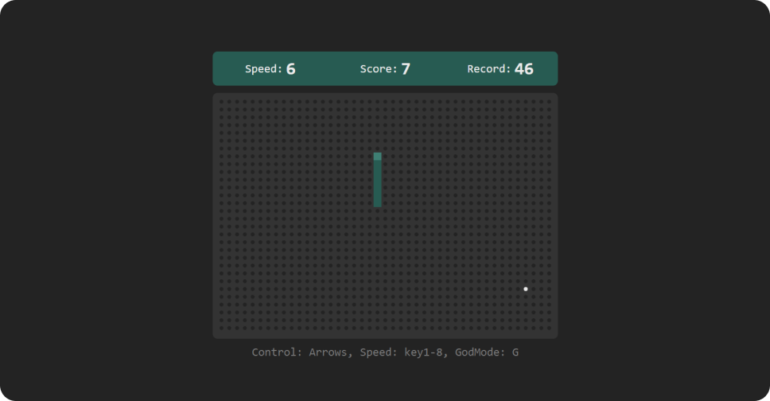

### Implementation of the Snake game in JavaScript.
⚠ So far, only for desktop gameplay (⚆_⚆)

You can play here:
https://buninman.github.io/Snake/

Code analysis with detailed explanations here:
https://blog.buninman.ru/snake (ru)

# What's new?
1. New design of the playing field
2. New high score counter
3. Added the ability to change the speed of the snake. PgUp, PgDwn and 1-8 keys 
4. Created the GodMode, the snake can't eat itself. G button
5. Snake Control Hint
6. Now you can't turn 180° and bite yourself. The snake doesn't die from accidental pressing

⚠ To work, you need an http-server. I used Live Server Extension in Visual Studio Code